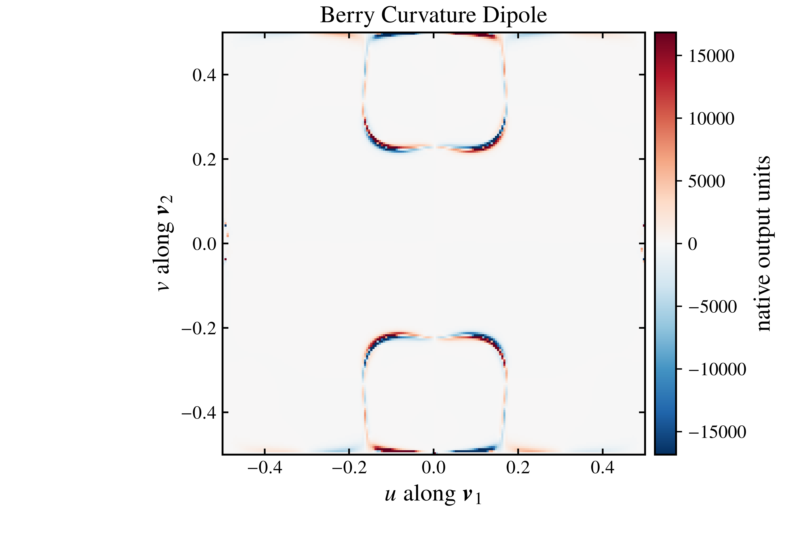
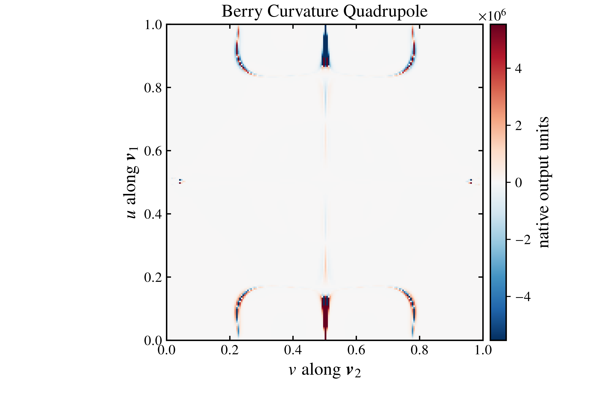
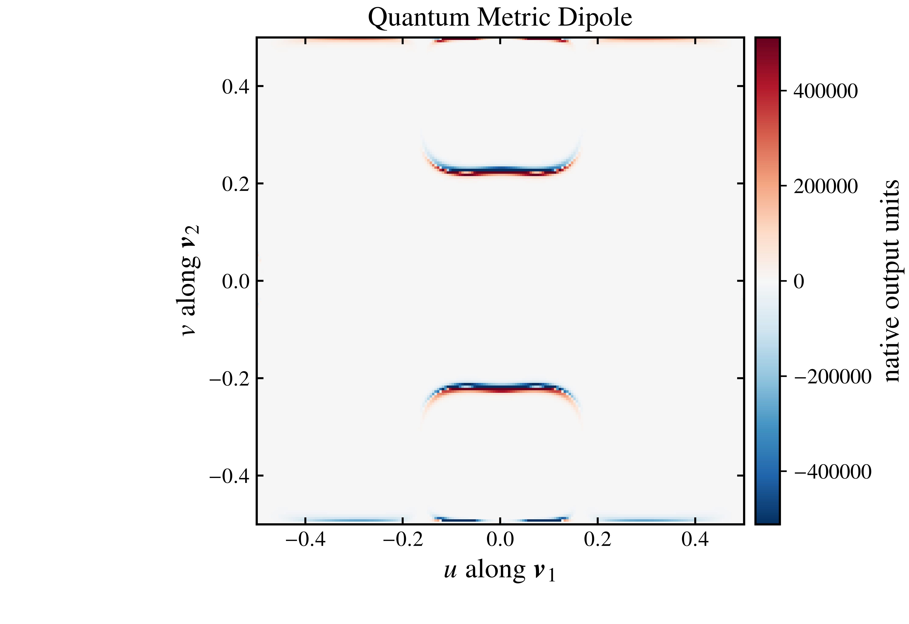
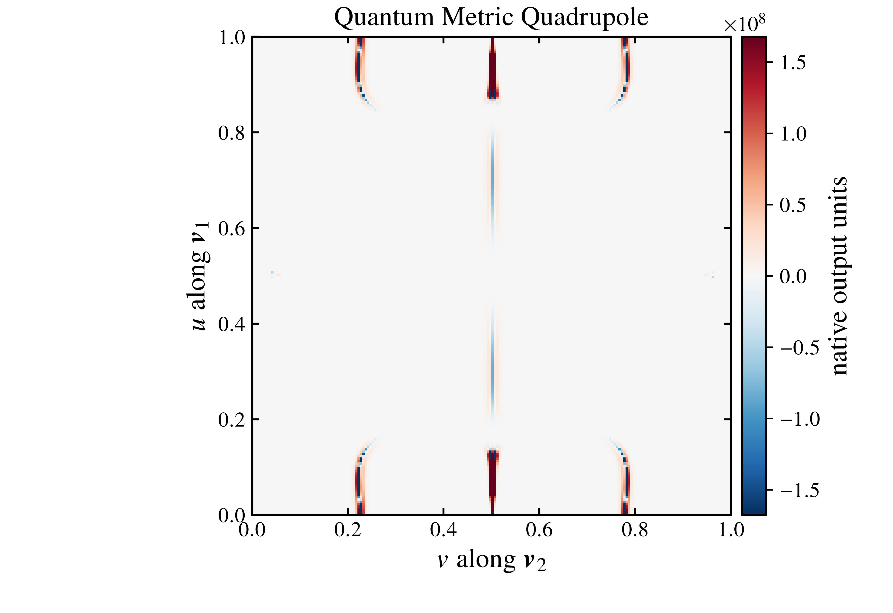
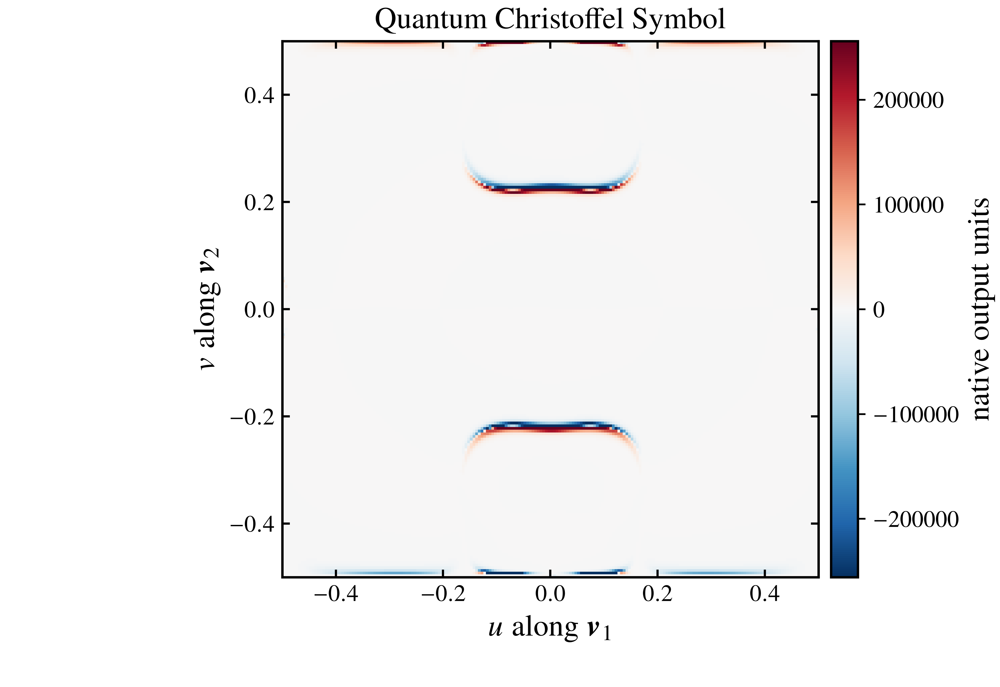

# Quantum-geometric multipoles

First and second momentum derivatives and the quantum Christoffel symbol.

## 1. Physical quantity and method

Each row is one independently executable `TaskConfig`. Integral tasks retain the complete native tensor; the component column is the default visualization selection.

| Case | Quantity | Method | Reference mesh | Photon energy (eV) | Component | Band selection | Optional spin data |
|---|---|---|---:|---:|---|---|---|
| `berry_curvature_dipole_conventional.jl` | `berry_curvature_dipole` | `conventional` | 200×200 | None | `(1,2,2)` | `{"subspace":[19,20]}` | no |
| `berry_curvature_quadrupole_conventional.jl` | `berry_curvature_quadrupole` | `conventional` | 200×200 | None | `(1,2,2,2)` | `{"subspace":[19,20]}` | no |
| `quantum_metric_dipole_conventional.jl` | `quantum_metric_dipole` | `conventional` | 200×200 | None | `(2,2,2)` | `{"subspace":[19,20]}` | no |
| `quantum_metric_quadrupole_conventional.jl` | `quantum_metric_quadrupole` | `conventional` | 200×200 | None | `(2,2,2,2)` | `{"subspace":[19,20]}` | no |
| `quantum_christoffel_symbol_conventional.jl` | `quantum_christoffel_symbol` | `conventional` | 200×200 | None | `(2,2,2)` | `{"subspace":[19,20]}` | no |

Derivative indices precede the underlying geometry indices: BCD `(d,a,b)`, BCQ `(d1,d2,a,b)`, QMD `(d,a,b)`, QMQ `(d1,d2,a,b)`. QCS uses `(a,b,c)`.

## 2. Inputs

- Model: [GeS SOC TB model](../../Materials/GeS/vasp_SOC/README.md).
- Structure and audit inputs: `GeS.win`, `POSCAR`, `INCAR`, `KPOINTS`, and input manifests in the same material directory.
- This chapter needs only the committed ordinary `GeS_tb.dat` model.
- Protected VASP files are not distributed; `POTCAR.txt` records the pseudopotential choices.

## 3. Parameter contract

| Parameter | Reference value |
|---|---|
| Fermi energy / temperature | `-2.5 eV` / `0 K` for optical tasks |
| Broadening | Gaussian, `0.060 eV` for optical tasks |
| Denominator regularization | `0.001 eV` where applicable |
| Finite-difference step | `1e-4 Å^-1` for derivative geometry |
| Degeneracy threshold | `0.002 eV` |
| Bands | `V=[19,20]`, `C1=[21,22]`, `C2=[23,24]` |
| Fourier / centers | `direct` / `Convention_II` |
| Output precision | 17 digits; no tutorial-side numerical reordering or truncation |

The case file is authoritative: parameters irrelevant to a quantity are not artificially applied. `smoke` changes only mesh/path density.

## 4. Run and visualize

```bash
julia --project=. examples/07_qg_multipoles/run.jl --profile=smoke
julia --project=. examples/07_qg_multipoles/run.jl --profile=reference
julia --project=. scripts/visualize_all.jl
```

Individual smoke commands:

```bash
julia --project=. examples/07_qg_multipoles/cases/berry_curvature_dipole_conventional.jl --profile=smoke
julia --project=. examples/07_qg_multipoles/cases/berry_curvature_quadrupole_conventional.jl --profile=smoke
julia --project=. examples/07_qg_multipoles/cases/quantum_metric_dipole_conventional.jl --profile=smoke
julia --project=. examples/07_qg_multipoles/cases/quantum_metric_quadrupole_conventional.jl --profile=smoke
julia --project=. examples/07_qg_multipoles/cases/quantum_christoffel_symbol_conventional.jl --profile=smoke
```

Existing result directories are never overwritten.

## 5. Output interpretation

- `kslice_berry_curvature_dipole_conventional`: `GeS_bcdk_subspace_19_20_conv.dat`
- `kslice_berry_curvature_quadrupole_conventional`: `GeS_bcqk_subspace_19_20_conv.dat`
- `kslice_quantum_metric_dipole_conventional`: `GeS_qmdk_subspace_19_20_conv.dat`
- `kslice_quantum_metric_quadrupole_conventional`: `GeS_qmqk_subspace_19_20_conv.dat`
- `kslice_quantum_christoffel_symbol_conventional`: `GeS_qcsk_subspace_19_20_conv.dat`

Every task directory also contains native `metadata.txt` and a tutorial `summary.json` with input/output SHA-256 values. Complex K-slice quantities retain separate real (`_r_`) and imaginary (`_i_`) files; the default figure shows the real part. `raw/`-style quantities retain the package's native stable filenames without renaming.

## 6. Figure-reading guide

K-slice rendering uses the package's periodic-centered `fftshift + transpose` convention. Heat-map color limits use the symmetric 99.5th percentile for presentation and the sidecar records that clipping; numerical files remain unchanged. Integral figures show the declared component. All PNGs are white-background 600 dpi and each PDF/PNG pair has a `.plot.json` audit sidecar.

Reference-profile figures below display the selected components and units stated in the case table and axes. The PNG/PDF files are presentation artifacts, not additional convergence evidence.

  [PDF](figures/kslice_berry_curvature_dipole_conventional.pdf) [Plot audit](figures/kslice_berry_curvature_dipole_conventional.plot.json)

*Conventional Berry-curvature dipole of subspace [19,20], component (1,2,2); native output units; presentation only.*

  [PDF](figures/kslice_berry_curvature_quadrupole_conventional.pdf) [Plot audit](figures/kslice_berry_curvature_quadrupole_conventional.plot.json)

*Conventional Berry-curvature quadrupole of subspace [19,20], component (1,2,2,2); native output units; presentation only.*

  [PDF](figures/kslice_quantum_metric_dipole_conventional.pdf) [Plot audit](figures/kslice_quantum_metric_dipole_conventional.plot.json)

*Conventional quantum-metric dipole of subspace [19,20], component (2,2,2); native output units; presentation only.*

  [PDF](figures/kslice_quantum_metric_quadrupole_conventional.pdf) [Plot audit](figures/kslice_quantum_metric_quadrupole_conventional.plot.json)

*Conventional quantum-metric quadrupole of subspace [19,20], component (2,2,2,2); native output units; presentation only.*

  [PDF](figures/kslice_quantum_christoffel_symbol_conventional.pdf) [Plot audit](figures/kslice_quantum_christoffel_symbol_conventional.plot.json)

*Conventional quantum Christoffel symbol of subspace [19,20], component (2,2,2); native output units; presentation only.*

## 7. Relation to the manuscript

This tutorial follows quantities and parameter choices used in the manuscript workflow, but uses the released ordinary GeS model and a separately audited VASP display reference. It is not a byte-identical reconstruction of the manuscript's SAWF band bundle and is not evidence that manuscript figures were reproduced.

## 8. Qualification limits

Committed outputs are `TUTORIAL_NUMERICAL_EVIDENCE`: finite, hashed, and reproduced with WannierNLQG v1.0.1 at the stated mesh. They are not Physics PASS or Production PASS. Differences between Conventional, Geometric Loop, and Wilson Loop are displayed as method differences, not automatically classified as errors.
