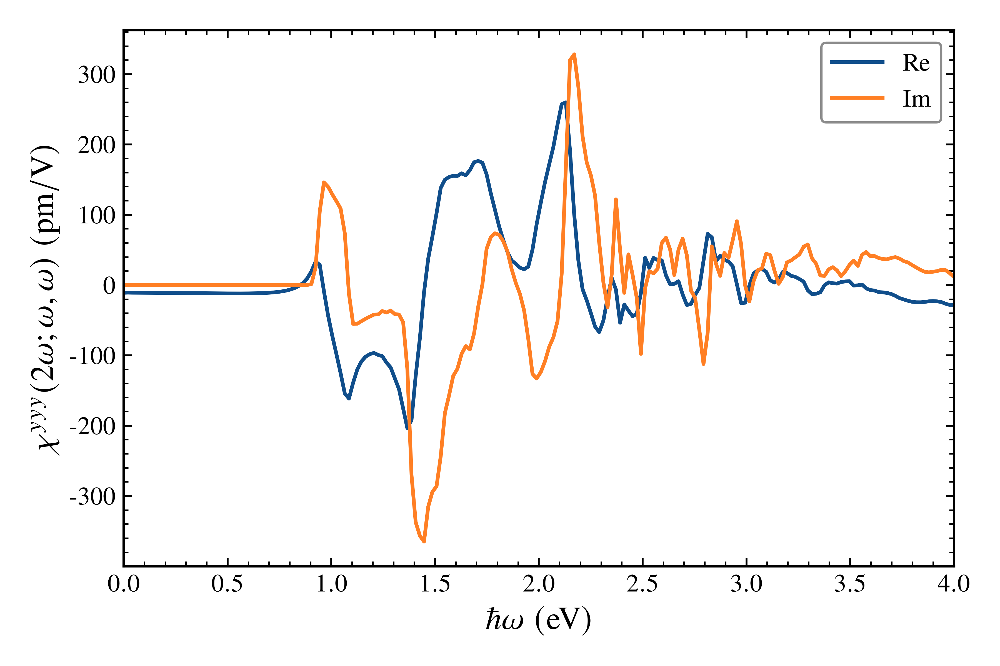
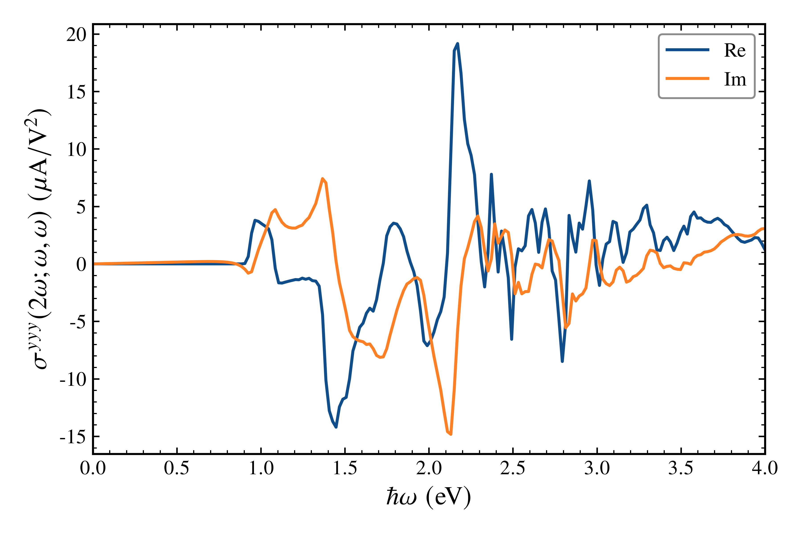

# GeS second-harmonic generation

This chapter calculates the independent-particle, electric-dipole SHG response of
the supplied 32-orbital spinor GeS model. It uses the v1.1.0 Conventional method
and a full Brillouin-zone integral. The calculated output frequency is (2\omega);
the horizontal axis gives the incident photon energy \(\hbar\omega\).

## Input and numerical contract

- Runtime model: [GeS SOC TB model](../../Materials/GeS/vasp_SOC/README.md), using all 32 model bands and
  `Convention_II`. No additional spin factor is applied to this spinor model.
- Reference sampling: `100 × 100 × 1`; smoke sampling: `2 × 2 × 1`. The SHG
  `spatial_dimension` is 3 in both profiles.
- Incident photon energies: 200 equally spaced values from 0 to 4 eV.
  `E_F = -2.5 eV`, `T = 0 K`.
- `SHGNumerics`: Gaussian resonance `broadening = 0.04 eV`,
  `low_frequency_broadening = 0.001 eV`,
  `intermediate_regularization = 0.001 eV`,
  `eta_correction = true`, `degeneracy_threshold = 1e-4 eV`.
- Direct Fourier interpolation, input real-space replicas, full Cartesian tensor,
  susceptibility and conductivity totals, 17-digit result formatting.

The 40 meV `broadening` sets the width of the \(\omega\) and \(2\omega\)
transition resonances. The 1 meV low-frequency width regularizes factors with
small incident photon energy. The separate 1 meV intermediate-state parameter
regularizes nearly degenerate energy denominators in the matrix elements and
three-band sum. These controls are physically distinct and cannot be replaced
by one complex photon energy. The finite-eta correction is enabled together
with the intermediate-state regularization.

## Run and visualize

Before the public v1.1.0 tag is available, use the local formal v1.1.0 source:

```bash
julia --project=/path/to/wannierNLQG-v1.1.0 \
  examples/10_second_harmonic_generation/run.jl --profile=smoke
julia --project=/path/to/wannierNLQG-v1.1.0 \
  examples/10_second_harmonic_generation/run.jl --profile=reference
python3 scripts/plot_shg_spectrum.py \
  examples/10_second_harmonic_generation/plot_configs/shg_chi_yyy.json
python3 scripts/plot_shg_spectrum.py \
  examples/10_second_harmonic_generation/plot_configs/shg_sigma_yyy.json
```

The calculation requires Julia and WannierNLQG v1.1.0. Plotting requires NumPy,
Matplotlib, Times New Roman, and a LaTeX installation with `newtxtext`,
`newtxmath`, `bm`, and `textgreek`. A case refuses to overwrite an existing result
directory.

## Results and interpretation

Each profile writes 18 `shg_chi_abc.dat` and 18 `shg_sigma_abc.dat` files. The
incident-field indices are symmetric and ordered `xx, yy, zz, yz, xz, xy` for
each output direction `x, y, z`. Every file contains `energy_eV total_re total_im`.
Susceptibility has units `pm/V`; conductivity has units `A/V^2`. The two
finite-broadening responses are evaluated separately, so the numerical files
must not be converted into one another by multiplying by a complex frequency.
The `yyy` real and imaginary curves are the display examples; the conductivity
plot is scaled by `10^6` and labeled in `μA/V²`, while its native table remains
in `A/V²`. All 18 components
of each response remain in the reference result directory.





The plotted `yyy` response is tied to the stated spinor GeS model and to the
3D normalization of its supercell, including the vacuum direction. It is not
an intrinsic sheet susceptibility. At exactly zero temperature, the package
omits the distributional one-band Fermi-surface contribution; this tutorial
does not qualify a zero-temperature metal.

`summary.json` records input/output SHA-256, exact parameters, runtime version,
thread count and source-manifest identity. The images are presentation artifacts;
their `.plot.json` sidecars bind each plot to its input table.

## Qualification

The numerical files are `TUTORIAL_NUMERICAL_EVIDENCE`. The figures are
`PRESENTATION_ONLY`. The fixed `100 × 100 × 1` mesh and chosen widths have not
been shown converged against k sampling, broadening, intermediate regularization,
Wannier windows or near degeneracies. Package engineering tests and finite
GeS spectra do not establish material Physics or Production qualification.
