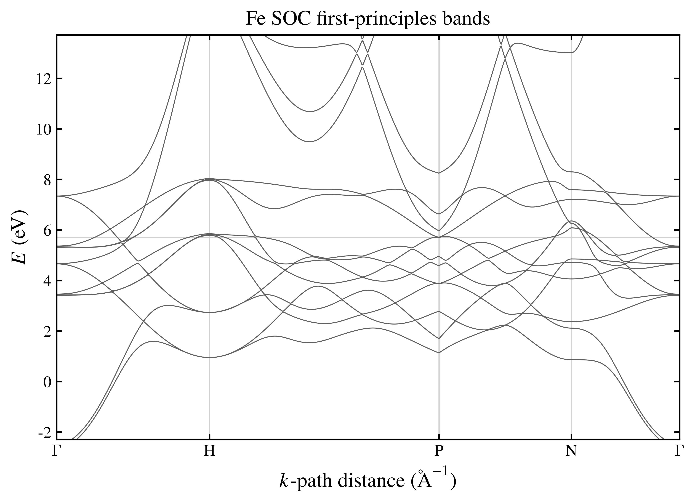
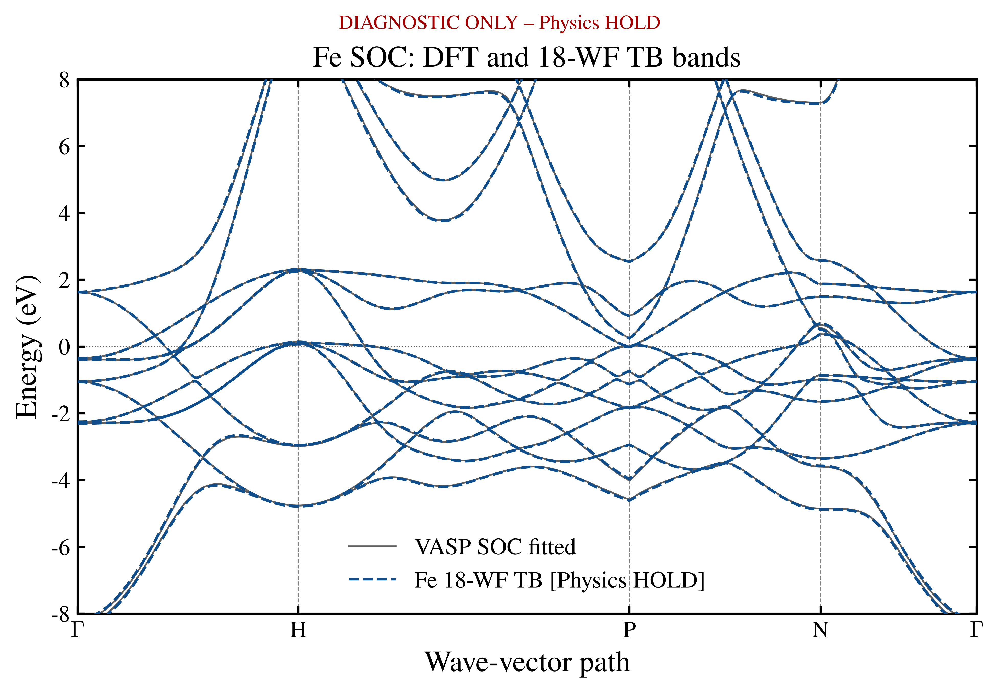
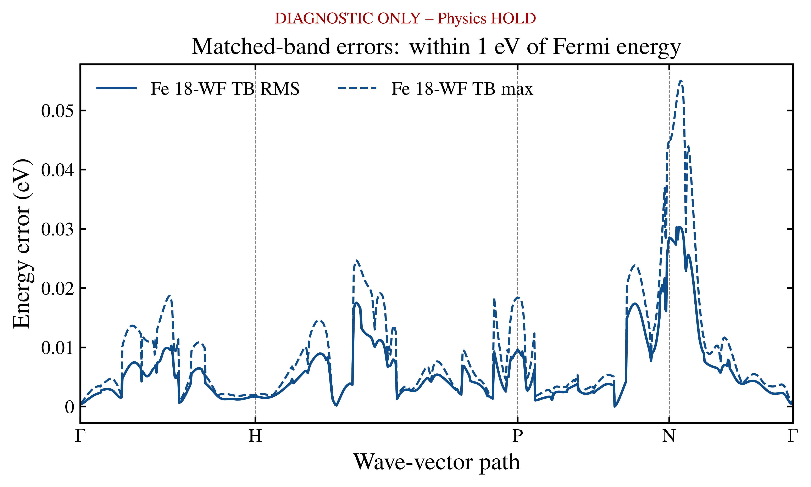
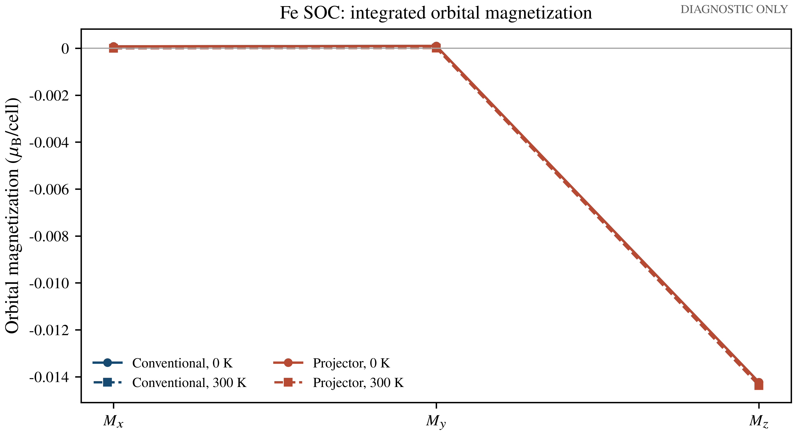
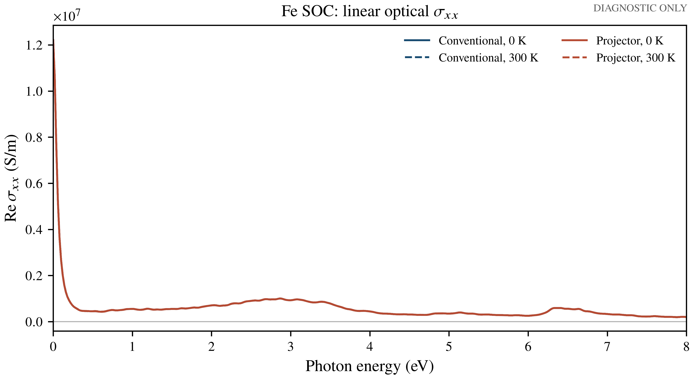
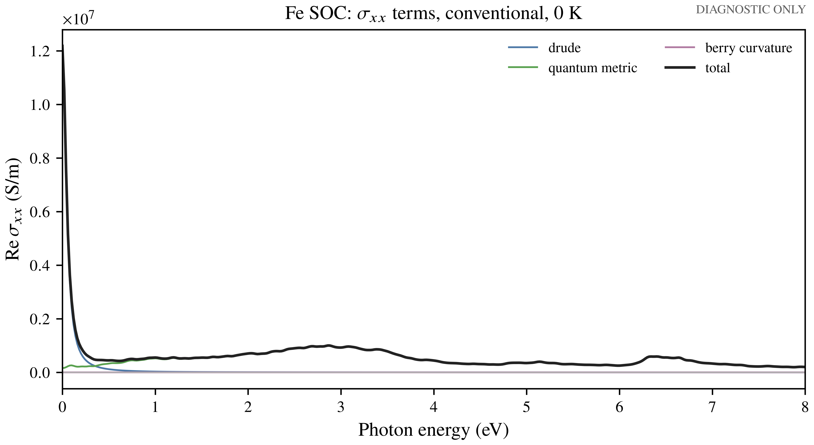
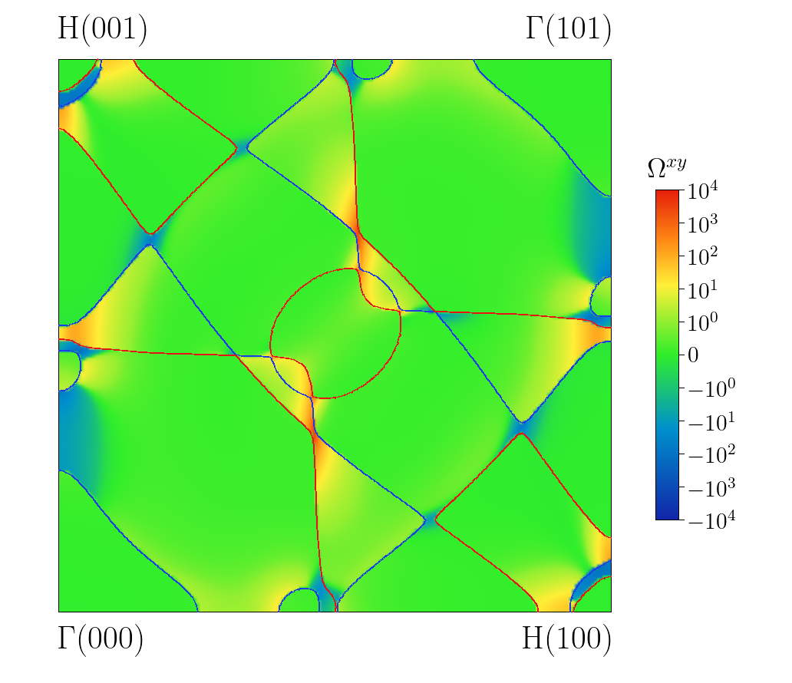

# Fe SOC: OAM and linear response

This chapter pairs a newly rerun 18-WF WannierNLQG v1.1.0 model with four
`Conventional/Projector × 0/300 K` examples in each integral family. It also
compares first-principles and TB path bands and two routes to `ky=0` Berry
curvature. The actual solver terminal state and model hashes are recorded in
[`MODEL_STATUS.json`](../../Materials/Fe/vasp_SOC/MODEL_STATUS.json).
Throughout this chapter, `DIAGNOSTIC_ONLY / Physics HOLD / Production
NOT_ELIGIBLE` applies. A finite `MAX_ITERATIONS` state is readable, not a
converged material prediction.

## Calculation contract

| Family | Reference grid | Output |
|---|---:|---|
| OAM | `40×40×40` | SRocc, CMocc, total; `μB/cell` |
| Linear Transport | `40×40×40` | Drude, quantum-metric, Berry-curvature contributions, total; `S/m` |
| Linear Optical Response | `40×40×40` | same three mechanisms plus total, complex tensor at `0:0.02:8 eV`; `S/m` |

All responses use `E_F=5.7156290716733436 eV`, the full operator bundle,
`Convention_II`, input-aware replica policy, and direct Fourier interpolation.
Transport/optical rates are `γ_intra=γ_inter=0.05 eV`; at 0 K the
Fermi-surface regularizer is Gaussian `eta_fs=0.05 eV`. The reference task
identities and table hashes are in `results/reference/*/summary.json`
and the repository-wide `manifests/results_manifest.json`.

The native transport and optical files follow `drude, quantum_metric,
berry_curvature, total`. The `berry_curvature` conductivity channel combines
the former ambient-curvature contact and interband Hall terms and represents
the anomalous-Hall-effect mechanism. With finite relaxation (and at finite
optical frequency), it is not itself a static SOS Berry-curvature map.
[`THREE_MECHANISM_VALIDATION.json`](results/reference/THREE_MECHANISM_VALIDATION.json)
binds the new response source and native file contract. Fe TB and bundle retain
their earlier Wannierization-source identity; response re-export cannot change
the model's physics qualification. Historical five-term results remain only in
the private rollback and comparison evidence.

The two `ky=0` cases use the same `200×200` uncentered slice, with
`origin=(0,0,0)`, `v₁=(-0.5,0.5,0.5)`, and `v₂=(0.5,0.5,-0.5)`:

1. `berry_sos_occupied_xy` computes occupied-band conventional `Ωxy`, using
   `0.001 eV` denominator regularization.
2. `berry_transport_equivalent_xy` converts the conventional 0-K
   Berry-curvature/AHE response integrand to `-berry_curvature/C`, with
   `C=e²/ℏ × 10⁻²⁰ = 2.4341348072793882e-24` in the package convention.

The transport-derived field includes `0.05 eV` relaxation; it need not equal
the SOS field point by point. The native K-slice ordering has `u` fastest;
the matrix reshapes `(v,u)` and transposes to `(u,v)`. The Berry images retain
the report's uncentered periodic cell, Γ/H corner labels, signed-log-exponent
palette (`linthresh=1`, green zero), with the **same fixed ±10⁴ colorbar**
for both paths. Neither image clips a pixel at this display limit; the
underlying `200×200` tables were not altered to fit the colorbar. This is a
presentation choice, not a numerical or
material-qualification gate. The
[Berry presentation contract](plot_configs/berry_legacy_style_contract.json)
records each new image hash and clipping count; the historical colorbar
unification receipt remains in private rollback evidence.

## Path bands

The publishable [VASP path table](../../Materials/Fe/vasp_SOC/bands/Fe_vasp_path_absolute.dat)
has 801 k points and 64 spinor bands. It comes from a validated fixed-charge
LMAXMIX=4 path calculation; VASP was not rerun for this tutorial. The
[receipt](../../Materials/Fe/vasp_SOC/bands/Fe_vasp_path_receipt.json)
binds its input hashes, common SCF Fermi level, path coordinates, and Γ-point
consistency check. The matching TB table has 801 points and 18 bands, using
the same Γ–H–P–N–Γ path and absolute-energy reference. The diagnostic
comparison uses per-k energy-set matching only: it does not assert band
wavefunction identity or an accepted material fit. The sidecar band summary
contains numerical errors and any degeneracy conflicts. In the ±1 eV window,
the diagnostic energy-set RMS is `0.0099 eV` and the maximum is `0.055 eV`;
202 k points retain degeneracy-cluster conflicts, so no fit gate passes.







## Run and inspect

The 18-WF TB is provided with the [Fe SOC material inputs](../../Materials/Fe/vasp_SOC/README.md). The full 11-operator
bundle is intended as a separate Release asset; see
[`FE_BUNDLE_FILES.json`](../../Materials/Fe/vasp_SOC/FE_BUNDLE_FILES.json)
and `scripts/install_fe_bundle.sh`. After installing it, or setting
`FE_OPERATOR_BUNDLE` to a verified copy, run from the repository root:

```bash
export WANNIERNLQG_V110_PROJECT=/path/to/frozen/WannierNLQG-v1.1.0
julia --project=. scripts/run_group.jl 11 --profile=smoke
```

Smoke uses `2³` integrals and `4×4` slices. To run a single case, use
`julia --project=/path/to/WannierNLQG-v1.1.0` with
`cases/fe_response.jl --task=oam_conventional_T000 --profile=smoke`.
Existing output directories are not overwritten. The `40³` and `200×200`
reference tables are provided for inspection; rerunning them is not needed
just to verify their SHA-256 identities. Optical per-frequency derivative
scratch is intentionally excluded from the public payload.







 [PDF](figures/berry_legacy_style_sos.pdf)

 [PDF](figures/berry_legacy_style_transport_equivalent.pdf)

`scripts/plot_fe_integral_response.py` and `scripts/plot_fe_berry_legacy.py`
regenerate the response figures. For either Berry table, pass
`--color-limit 10000` to reproduce the shared colorbar; the other defaults
retain the `200×200` uncentered slice, Γ/H labels, and `linthresh=1`.
PNG/PDF display, algebraic closure, source
hashes, and source readback are separate checks. None of them establishes
k-mesh or Wannier-window convergence, Physics PASS, or Production eligibility.
