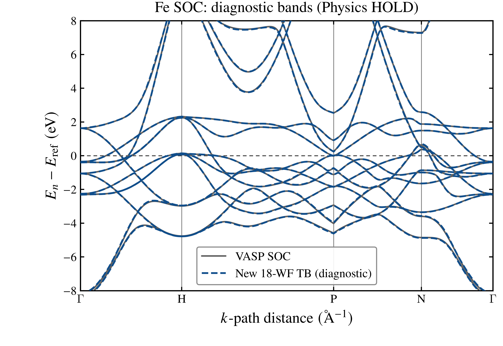
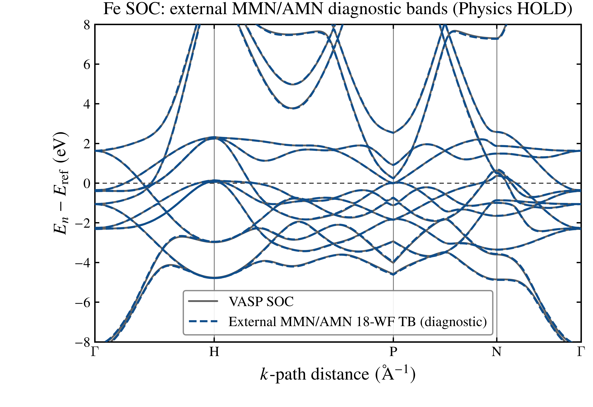

# Fe SOC Wannierization: source to diagnostic bands

This chapter runs the WannierNLQG solver on Fe wavefunctions, computes bands
from **that run's** 18-WF TB, and compares them with published 64-band VASP
bands. Solver convergence is not required for this diagnostic lesson. An
accepted-state TB must actually be exported before the band steps can run.
All results remain `DIAGNOSTIC_ONLY / Physics HOLD / Production NOT_ELIGIBLE`.

The default `run.jl --profile=smoke|reference` is still the historical
**offline readback** used by the repository-wide smoke runner. It does not run
VASP or Wannierization.

## 1. Prepare the Fe source

The **native PAW route used for the §3 result** requires `POSCAR`,
`POTCAR`, `INCAR`, `OUTCAR`, `WAVECAR`, `wannier90.win`, `wannier90.eig`, and
`wannier90.mmn` from one Fe SOC calculation in an external work directory.
The raw MMN supplies neighbor topology; WAVECAR and POTCAR supply the data
for new PAW MMN/AMN. Raw `wannier90.amn` is not used on this route. For an
alternative that reads complete external MMN/AMN without WAVECAR, see §4.

Stage the [redistributable inputs](../../Materials/Fe/vasp_SOC/) into a new
directory, supply the matching licensed `POTCAR`, and follow the
[VASP instructions](../../Materials/Fe/vasp_SOC/README.md). If you already
have the complete matching source calculation, use it without rerunning VASP.
Protected VASP files and Wannier intermediates are not distributed.

```bash
python3 examples/12_fe_wannierization/stage_rebuild.py --workdir /path/to/new-fe-workdir
# Supply a licensed POTCAR there, then run the staged run_vasp.sh.
```

The comparison uses the published [801-point VASP path table](../../Materials/Fe/vasp_SOC/bands/Fe_vasp_path_absolute.dat)
and its [source receipt](../../Materials/Fe/vasp_SOC/bands/Fe_vasp_path_receipt.json).
This chapter does not rerun the fixed-charge path calculation.

## 2. Run Wannierization

Use WannierNLQG 1.1.0 with a Julia version supported by its project
(`julia = "1.10"`); this Fe run was verified with Julia 1.11.2 and four Julia
threads. Other supported versions and thread counts are not covered by the
published numerical receipt. The comparison also needs Python 3 with NumPy.
Choose a `FE_OUTPUT` path that does not yet exist. From the tutorial root:

```bash
export WANNIERNLQG_V110_PROJECT="/path/to/WannierNLQG-v1.1.0"
export FE_WORKDIR="/path/to/fe-vasp-source"
export FE_OUTPUT="/path/to/new-fe-output"
export JULIA_NUM_THREADS=4 OPENBLAS_NUM_THREADS=1
julia --project="$WANNIERNLQG_V110_PROJECT" \
  examples/12_fe_wannierization/wannierize_fe.jl "$FE_WORKDIR" "$FE_OUTPUT"
julia --project="$WANNIERNLQG_V110_PROJECT" \
  examples/12_fe_wannierization/verify_fe_model.jl "$FE_WORKDIR" "$FE_OUTPUT"
```

Read the 81-line [solver script](wannierize_fe.jl) top to bottom. Its input,
solver, checkpoint, and output configuration remain together. The
[run-record helper](fe_run_record.jl) captures pre-solve identity; the
independent [model verifier](verify_fe_model.jl) checks that identity, writes
the terminal receipt, and reads back the artifacts:

| Setting | Value | Role |
| --- | --- | --- |
| `source` | Fe VASP `POSCAR/POTCAR/INCAR/OUTCAR/WAVECAR`, spinor bands `1:64` | Wavefunctions and native PAW matrix elements |
| `projection_basis` | Fe s/p/d from `wannier90.win`, `num_wannier=18` | Initial 18-WF subspace |
| `wannierization_mode` | `:ordinary` | Full-BZ Wannierization without a symmetry-reduced target |
| `outer_min_ev/outer_max_ev` | `-8/50` | Disentanglement window in eV |
| `frozen_min_ev/frozen_max_ev` | `-8/20` | States retained exactly in eV |
| `solver` | AMN start, fixed two-stage, tolerance `1e-10` | Original Fe optimization settings |
| `checkpoint` | Every 50 iterations; total ceiling 2500 | Retains the last accepted state |
| `output.profile` | `:hamiltonian_position` | Hamiltonian and position for TB bands |

The raw MMN provides topology while `NativeVASPPAWMatrices` regenerates its
numerical overlaps and AMN. The H/r profile does not change convergence;
full-profile SPN/uIu/uHu/sIu/sHu inputs are unnecessary here. The solver's
`constraint_operation_scope=:full` refers to its constraint scope, not to
the 11-operator output profile.

The solver writes `$FE_OUTPUT/attempt1.json` with its pre-solve source/input
hashes, Julia environment, actual terminal status, accepted iteration, and
artifact paths. The verifier rejects changed inputs or source code, then writes
`terminal_result.json` with artifact hashes and checks the accepted checkpoint,
18-orbital TB, and H/r bundle. The disentanglement and localization stages each
have a 1000-step cap, so this configuration can stop before the 2500 total-iteration
ceiling. It does not auto-restart. `selected_model.json` appears only after
verification; the band script requires that file. If no TB passes the
accepted-state structural export gate, verification stops here and never
substitutes the historical `Fe_tb.dat`.

## 3. Compute and compare bands

After the new TB exists:

```bash
julia --project="$WANNIERNLQG_V110_PROJECT" \
  examples/12_fe_wannierization/fe_bands.jl "$FE_OUTPUT"
python3 examples/12_fe_wannierization/compare_fe_bands.py "$FE_WORKDIR" "$FE_OUTPUT"
julia --project="$WANNIERNLQG_V110_PROJECT" \
  "$WANNIERNLQG_V110_PROJECT/scripts/plot_band_structure.jl" \
  --config "$FE_OUTPUT/band_plot.json"
```

The `Band` task calculates 801 points on Γ–H–P–N–Γ from **this run's TB**.
The comparison checks the lattice, path coordinates and distances, both band
tables, hashes, and common SCF Fermi reference. It applies no fitted shift.
The overlay and `comparison_result.json` are an energy-set diagnosis. Its
nearest-VASP-energy numbers allow many TB bands to select the same VASP band;
they are neither wavefunction matching nor a material-fit pass. Complete run
artifacts remain in `$FE_OUTPUT` outside the public repository; only the
checked lightweight table, PNG, and path-free receipt are copied below.

### Recorded first-run result (2026-09-25)



The published [18-band table](results/native_paw_2026-09-25/Fe_new_tb_path_absolute.dat)
and [hash receipt](results/native_paw_2026-09-25/RESULT.json) come from the
first accepted-state export, at iteration 2000 with `MAX_ITERATIONS`. The
requested total ceiling was 2500; the two 1000-step stage caps stopped it
earlier. The recorded continuation to iteration 2001 was started before the
no-restart instruction, is retained as unselected local evidence, and was not
used for this table or plot. The near-Fermi nearest-energy-set RMS is about
`0.00981 eV`; that many-to-one number is diagnostic only. The new large TB,
bundle, checkpoint, and licensed VASP inputs are not published.

## 4. Optional alternative solve: external MMN/AMN

[wannierize_fe_with_mmn_amn.jl](wannierize_fe_with_mmn_amn.jl) shows the
shorter ordinary-mode input route. It reads complete `wannier90.win`, `.eig`,
`.mmn`, and `.amn` from **one** Fe SOC calculation; `WAVECAR`, `POTCAR`,
`INCAR`, and `OUTCAR` are not read by this solver route. `POSCAR` and `OUTCAR`
are retained alongside the matrices for source identity and the later band
comparison. The upstream VASP calculation still needs its licensed POTCAR.
Keep the spinor basis, 64 bands,
18 projections, lattice, and k-mesh consistent. The package does not silently
replace a missing VASP AMN with a pseudo-only projection.

```bash
export FE_MATRIX_DIR="/path/to/complete-fe-wannier90-files"
export FE_MATRIX_OUTPUT="/path/to/new-external-matrix-output"
julia --project="$WANNIERNLQG_V110_PROJECT" \
  examples/12_fe_wannierization/wannierize_fe_with_mmn_amn.jl \
  "$FE_MATRIX_DIR" "$FE_MATRIX_OUTPUT"
julia --project="$WANNIERNLQG_V110_PROJECT" \
  examples/12_fe_wannierization/verify_fe_model.jl \
  "$FE_MATRIX_DIR" "$FE_MATRIX_OUTPUT"
julia --project="$WANNIERNLQG_V110_PROJECT" \
  examples/12_fe_wannierization/fe_bands.jl "$FE_MATRIX_OUTPUT"
python3 examples/12_fe_wannierization/compare_fe_bands.py \
  "$FE_MATRIX_DIR" "$FE_MATRIX_OUTPUT"
julia --project="$WANNIERNLQG_V110_PROJECT" \
  "$WANNIERNLQG_V110_PROJECT/scripts/plot_band_structure.jl" \
  --config "$FE_MATRIX_OUTPUT/band_plot.json"
```

The verifier records `matrix_source_kind=external_wannier90` and checks the
six-file source inventory (`POSCAR`, `OUTCAR`, WIN/EIG/MMN/AMN) before selecting
an exported TB. The comparison checks this route against the same published
VASP path, while keeping its TB and plot separate from the native-PAW result.
Its output is diagnostic only; no Wannier-function or band fit is qualified.

### Recorded external-matrix run (2026-09-25)



The [18-band table](results/external_w90_2026-09-25/Fe_new_tb_path_absolute.dat)
and [hash receipt](results/external_w90_2026-09-25/RESULT.json) come from the
original VASP WIN/EIG/MMN/AMN, not the native-PAW regeneration. The solver
ended `MAX_ITERATIONS` at accepted iteration 2000 (1000 disentanglement plus
1000 localization), with final metric `1.85e-7` against `1e-10`. It exported
an accepted-state 18-WF TB and H/r bundle, and both passed independent
readback. The Γ–H–P–N–Γ path has 801 points; the reference has 64 VASP bands.
The near-Fermi (±1 eV) nearest-energy-set RMS is `0.00981 eV`. This allows
many-to-one energy matches and is neither a wavefunction match nor a
production-quality assessment.

The run used WannierNLQG source commit `8f5e7c8` and source-manifest SHA-256
`5911b050475f86346f1023f8187311d78d7804d389fe047d526e8030d4921f01`.
The source checkout's README and manifest changed during the run; verification
and band calculation used an isolated snapshot of the recorded commit.
Large TB, checkpoint, and original VASP matrices remain outside this repository.

## 5. Historical readback and full reconstruction

The quick offline check is:

```bash
julia --project="$WANNIERNLQG_V110_PROJECT" \
  examples/12_fe_wannierization/run.jl --profile=smoke
```

It verifies the distributed [historical model status](../../Materials/Fe/vasp_SOC/MODEL_STATUS.json)
and Fe TB/VASP tables. The historical terminal state is `MAX_ITERATIONS`;
readability and band agreement do not imply convergence. For the complete
11-operator reconstruction and audits, consult the
[advanced driver](../../Materials/Fe/vasp_SOC/Fe_ordinary_full_driver.jl)
and [material guide](../../Materials/Fe/vasp_SOC/README.md).
